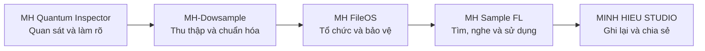

<div align="center">

# MH Sample FL

### Không gian quản lý sample local-first dành cho producer sử dụng FL Studio


[Website](https://studiominhhieu.com/) · [Trạng thái triển khai](docs/09-IMPLEMENTATION-STATUS.md) · [Kiểm thử](docs/05-TEST-ACCEPTANCE.md) · [Liên hệ](mailto:support@studiominhhieu.com)

</div>

> [!IMPORTANT]
> **MH Sample FL đang ở giai đoạn alpha.** Đây là dự án cá nhân được xây dựng trước hết cho quy trình làm nhạc của Minh Hiếu. Dự án chưa được công bố là sản phẩm thương mại, chưa phải bản phát hành ổn định và không được phép mô tả các phần chưa kiểm chứng như tính năng đã hoàn thành.

## Mục lục

- [Vì sao dự án này tồn tại?](#vì-sao-dự-án-này-tồn-tại)
- [Vị trí trong hệ sinh thái MH](#vị-trí-trong-hệ-sinh-thái-mh)
- [MH Sample FL giúp làm gì?](#mh-sample-fl-giúp-làm-gì)
- [Quy trình sử dụng dự kiến](#quy-trình-sử-dụng-dự-kiến)
- [Trạng thái triển khai](#trạng-thái-triển-khai)
- [Những gì chưa được xác nhận](#những-gì-chưa-được-xác-nhận)
- [Cài đặt cho người phát triển](#cài-đặt-cho-người-phát-triển)
- [Kiểm tra và đóng gói](#kiểm-tra-và-đóng-gói)
- [Cấu trúc dự án](#cấu-trúc-dự-án)
- [Tài liệu nguồn sự thật](#tài-liệu-nguồn-sự-thật)
- [Nguyên tắc an toàn](#nguyên-tắc-an-toàn)
- [Lộ trình](#lộ-trình)
- [Quyền sử dụng và liên hệ](#quyền-sử-dụng-và-liên-hệ)

## Vì sao dự án này tồn tại?

Khi làm nhạc lâu ngày, sample thường nằm rải rác trên nhiều folder và ổ đĩa. Tên file có thể khó đọc, nguồn tải bị quên, license không được lưu lại và một project cũ có thể thiếu đúng sample quan trọng.

MH Sample FL được tạo ra để giảm những công việc lặp lại đó:

- tìm đúng âm thanh nhanh hơn;
- nghe và xem thông tin trước khi đưa vào project;
- nhớ sample nào đã liên quan đến project nào;
- giữ thông tin nguồn và license;
- phát hiện file thiếu hoặc trùng mà không tự ý phá dữ liệu.

Mục đích đầu tiên là phục vụ công việc thật của chủ dự án. Khi phần mềm đủ ổn định, an toàn và có kiểm chứng thực tế, dự án mới được cân nhắc chia sẻ rộng hơn cho cộng đồng producer.

## Vị trí trong hệ sinh thái MH



MH Sample FL là phần gần nhất với quá trình sáng tác. Nó nhận thư viện đã được thu thập, sắp xếp và bảo vệ, sau đó giúp producer tìm, nghe, ghi nhớ và đưa sample vào FL Studio.

## MH Sample FL giúp làm gì?

| Nhóm | Khả năng hiện có hoặc đang triển khai | Nguyên tắc |
|---|---|---|
| Tìm kiếm | Quét folder, giữ cấu trúc cha–con, SQLite FTS5, filter và sort | Dùng dữ liệu thật |
| Preview | Nghe audio, xem waveform và metadata | Không sửa file nguồn |
| Ghi nhớ | Project Workspace, Project Memory, tags và notes | Phân biệt gửi sang FL với xác nhận đã dùng |
| Bảo vệ | SHA-256, exact duplicate report, file missing | Chỉ đọc hoặc mô phỏng trước |
| Nguồn gốc | Source, license và tài liệu chứng minh | Người dùng kiểm tra và bổ sung |
| Sao lưu | Backup SQLite và export JSON | Không bắt buộc cloud |
| FL Studio | Native file drag qua cơ chế hệ điều hành | Chưa gọi là tích hợp sâu |

## Quy trình sử dụng dự kiến

```text
1. Add Folder
   ↓
2. Discovery: tìm file và dựng cây thư mục
   ↓
3. Analyze: đọc metadata, hash và thông tin âm thanh
   ↓
4. Search / Filter / Preview
   ↓
5. Tạo hoặc chọn project
   ↓
6. Kéo sample sang FL Studio
   ↓
7. Người dùng xác nhận sample đã được dùng
   ↓
8. Lưu ghi chú, nguồn, license và backup
```

Quy trình trên là mục tiêu hành vi của ứng dụng. Một bước chỉ được coi là hoàn thành khi có source, test và bằng chứng runtime phù hợp.

## Trạng thái triển khai

**Phiên bản:** `v0.1.0-alpha`  
**Phạm vi hiện tại:** ứng dụng desktop độc lập  
**VST3:** chưa triển khai

### Bằng chứng hiện có

- `10/10` automated tests chạy thành công trên Windows CI.
- TypeScript `tsc --noEmit` thành công.
- Vite production renderer build thành công.
- Electron Builder tạo được installer NSIS.
- Packaged application đã qua smoke launch trên Windows runner.
- Integration test đã kiểm tra WAV thật, SQLite, FTS search, SHA-256 và backup.

Xem bảng requirement, source và bằng chứng chi tiết tại:

**[docs/09-IMPLEMENTATION-STATUS.md](docs/09-IMPLEMENTATION-STATUS.md)**

## Những gì chưa được xác nhận

> [!WARNING]
> Build hoặc smoke launch thành công không đồng nghĩa ứng dụng đã hoạt động đầy đủ trong điều kiện sử dụng thật.

Các phần sau vẫn phải giữ trạng thái chưa kiểm chứng:

- cài đặt và nghiệm thu đầy đủ trên máy Windows thật của chủ dự án;
- scan thư viện sample thật với giao diện redesign;
- preview audio và waveform trong runtime desktop thật;
- kéo file vào Channel Rack, Playlist hoặc Sampler của FL Studio;
- performance test với thư viện khoảng 100.000 sample;
- crash recovery và tình huống mất điện thực tế;
- phát hành installer ổn định cho người dùng cuối.

Không được dùng README, ảnh mockup hoặc file `.exe` để tạo cảm giác các mục này đã hoàn tất.

## Cài đặt cho người phát triển

### Yêu cầu

- Windows được ưu tiên cho nghiệm thu desktop.
- Node.js 24 trở lên.
- Git.

### Lấy source

```bash
git clone https://github.com/studiozengermany-cmd/MH-SAMPLE-FL-2026-.git
cd MH-SAMPLE-FL-2026-
npm install
```

### Chạy ở chế độ phát triển

```bash
npm run dev
```

Lệnh này khởi động Vite renderer và Electron development runtime.

## Kiểm tra và đóng gói

### Chạy test và production build

```bash
npm run check
```

Lệnh trên chạy:

```text
npm run test
→ node --test tests/*.test.cjs

npm run build
→ tsc --noEmit
→ vite build
```

### Tạo installer Windows NSIS

```bash
npm run dist:win
```

Quy trình đóng gói sẽ chạy kiểm tra trước rồi mới gọi Electron Builder. Artifact do GitHub Actions tạo chỉ là bằng chứng CI tạm thời, không tự động được xem là bản phát hành chính thức.

## Cấu trúc dự án

```text
MH-Sample-FL/
├─ src/
│  ├─ main/                    # Electron main, SQLite, indexer, filesystem
│  ├─ preload/                 # IPC bridge với context isolation
│  └─ renderer/                # React/TypeScript UI và workflow
├─ tests/                      # Unit và integration tests
├─ docs/                       # Đặc tả, kiến trúc, test và trạng thái
├─ .github/workflows/          # Windows CI và packaging
└─ package.json
```

Không có thư mục JUCE hoặc VST3 trong codebase hiện tại.

## Tài liệu nguồn sự thật

Đọc theo thứ tự phù hợp với công việc:

1. [Đặc tả tổng thể](docs/00-MASTER-SPEC.md)
2. [Kiến trúc app-first](docs/01-APP-FIRST-ARCHITECTURE.md)
3. [Mô hình dữ liệu](docs/02-DATA-MODEL.md)
4. [Đặc tả UI và hành vi](docs/03-UX-FUNCTIONAL-SPEC.md)
5. [Kế hoạch triển khai](docs/04-IMPLEMENTATION-PLAN.md)
6. [Kiểm thử và nghiệm thu](docs/05-TEST-ACCEPTANCE.md)
7. [Lộ trình VST3 giai đoạn sau](docs/06-VST3-PHASE-2.md)
8. [Nhật ký quyết định](docs/07-DECISION-LOG.md)
9. [Truy vết yêu cầu](docs/08-EXECUTION-GOVERNANCE.md)
10. [Trạng thái và bằng chứng](docs/09-IMPLEMENTATION-STATUS.md)

Khi README và tài liệu trạng thái xung đột, tài liệu requirement và evidence mới nhất phải được kiểm tra trước khi đưa ra tuyên bố.

## Nguyên tắc an toàn

1. Không tự động xóa, di chuyển, đổi tên, hard-link hoặc ghi đè file âm thanh gốc.
2. Không bắt buộc tài khoản cloud, API key hoặc gói trả phí cho workflow desktop cốt lõi.
3. Không hiển thị số liệu giả hoặc placeholder như dữ liệu thật.
4. Không coi build thành công là nghiệm thu tính năng.
5. Không gọi native file drag là tích hợp sâu với FL Studio.
6. Không bắt đầu VST3 trước khi ứng dụng desktop ổn định và có người dùng thật.
7. Mọi hành vi có rủi ro phải hiển thị tác động trước và để người dùng quyết định.

## Lộ trình

### Giai đoạn hiện tại — Desktop alpha

- hoàn tất nghiệm thu Windows thật;
- kiểm tra scan, preview, project memory và backup;
- kiểm tra native drag với FL Studio;
- ghi lại evidence bằng log, ảnh hoặc video.

### Giai đoạn tiếp theo — Closed testing

- thử nghiệm với một nhóm producer nhỏ;
- sửa lỗi từ workflow thật;
- đánh giá hiệu năng với thư viện lớn;
- hoàn thiện hướng dẫn sử dụng và quyền riêng tư.

### Giai đoạn sau — Chỉ khi được phê duyệt

- cloud opt-in;
- AI hỗ trợ metadata hoặc tìm kiếm;
- nghiên cứu VST3.

Các mục giai đoạn sau không phải chức năng hiện có.

## Quyền sử dụng và liên hệ

Package hiện đặt trạng thái `UNLICENSED`. Repository công khai nhằm minh bạch quá trình phát triển, không tự động cấp quyền sao chép, đóng gói lại hoặc sử dụng thương mại.

- Website: https://studiominhhieu.com/
- Email: support@studiominhhieu.com
- GitHub: https://github.com/studiozengermany-cmd

---

<div align="center">

**Ý tưởng và quyết định sản phẩm: Minh Hiếu**  
AI được sử dụng như công cụ hỗ trợ nghiên cứu và thực hiện; mục tiêu và quyết định cuối cùng vẫn do con người chịu trách nhiệm.

</div>
